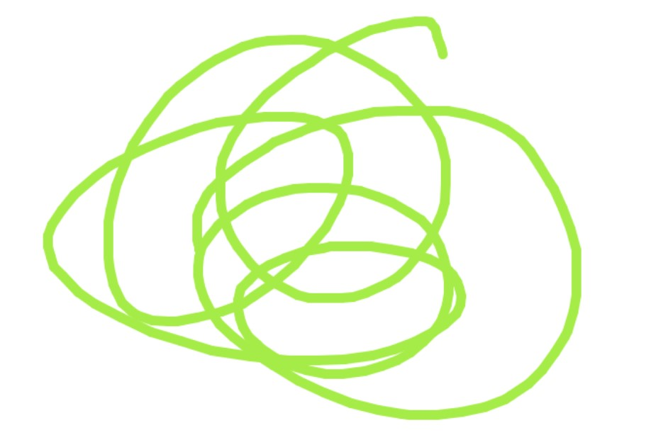
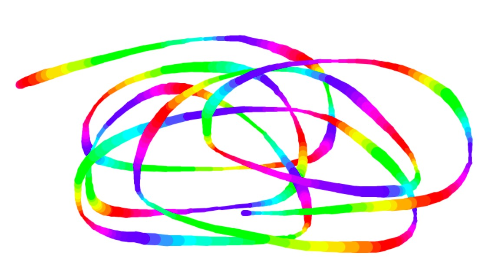

# canvas 畫圖


## 取得 canvas，並設定寬和高
```javascript
const canvas = document.querySelector("#draw");
canvas.width = window.innerWidth;
canvas.height = window.innerHeight;
```

## 取得 canvasContext，並設定基本參數
```javascript
const canvasContext = canvas.getContext("2d");
canvasContext.strokeStyle = "#BADA55"; // 設定勾勒圖形時用的顏色
canvasContext.lineJoin = "round"; // 讓線條轉彎時它的拐角是圓的
canvasContext.lineCap = "round"; // 讓線條末端是圓的
canvasContext.lineWidth = 10; // 線條寬度
```

## 創立一個繪畫的抽象物件
```javascript
const { startDrawing, exitDrawing, drawLine } = new Draw(canvasContext);
```
- Draw
    ```javascript
    function Draw(canvasContext) {
        let lastPos = { x: 0, y: 0 };
        let isDrawing = false;
        return { startDrawing, exitDrawing, drawLine };

        // helpers
        function startDrawing(e) {
            isDrawing = true;
            lastPos = [e.clientX, e.clientY];
        }
        function exitDrawing() {
            isDrawing = false;
        }
        function drawLine(e) {
            if (!isDrawing) return;
            canvasContext.beginPath();
            canvasContext.moveTo(lastPos.x, lastPos.y); // start from
            canvasContext.lineTo(e.clientX, e.clientY); // go to
            canvasContext.stroke();
            lastPos = { x: e.clientX, y: e.clientY };
        }
    }
    ```

## 事件監聽使用者的滑鼠
```javascript
canvas.addEventListener("mousemove", drawLine);
canvas.addEventListener("mousedown", startDrawing);
canvas.addEventListener("mouseup", exitDrawing);
canvas.addEventListener("mouseout", exitDrawing);
```
- mousemove `滑鼠移動`
- mousedown `滑鼠按下左鍵`
- mouseup `滑鼠放開左鍵`
- mouseout `滑鼠離開繪畫區域` (`<canvas>`)

## * How to Draw Special Line

- add `drawSpecialLine`
    ```javascript
    const { startDrawing, exitDrawing, drawLine, drawSpecialLine } = new Draw(canvasContext);
    ```
- replace `drawLine` with `drawSpecialLine`
    ```javascript
    canvas.addEventListener("mousemove", drawSpecialLine);
    ```
- add `drawSpecialLine()` in `Draw()`
    ```javascript
    function Draw(canvasContext) {
        // ...
        
        return { startDrawing, exitDrawing, drawLine, drawSpecialLine: drawSpecialLine() };
        
        // ...

        function drawSpecialLine() {
            let hue = 0;
            let isLineWidthIncreasing = true;

            return function (e) {
                // 控制顏色
                canvasContext.strokeStyle = `hsl(${hue}, 100%, 50%)`;
                hue += 10;

                // 控制線寬
                if (
                    canvasContext.lineWidth <= 5 || //
                    canvasContext.lineWidth >= 20
                ) {
                    isLineWidthIncreasing = !isLineWidthIncreasing;
                }
                isLineWidthIncreasing === true //
                    ? canvasContext.lineWidth++
                    : canvasContext.lineWidth--;

                drawLine(e);
            };
        }
    }
```