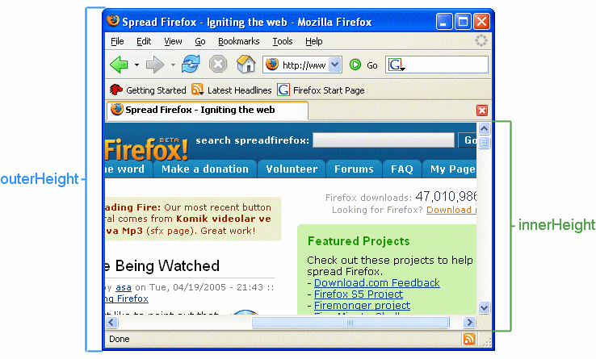
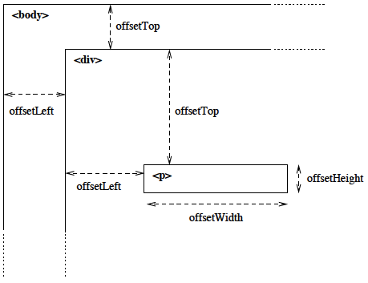

## window scroll event
- `window.addEventListener("scroll", func)` : 每次滾動都會呼叫 `func`
- 這麼做會太耗費資源，我們不需要觸發這麼頻繁，這時候可以加上 `debounce` 的功能
- `window.addEventListener("scroll", debounce(func))` : `debounce` 會回傳一個 callback，這個 callback 需要有間隔時間才能再次呼叫，因此效能將會提升


## window.innerHeight & window.scrollY 
- innerHeight : 視窗高度
  
    

- scrollY : 初始值為 0，滾動滾輪會遞增該數值


## element.offsetTop
- offsetTop : 該元素在父元素中的位置為何
  
    


##  element add | remove class
- `<element>.classList.add()`
- `<element>.classList.remove()`
```javascript
if (...) {
    image.classList.add("active");
} else {
    image.classList.remove("active");
}
```