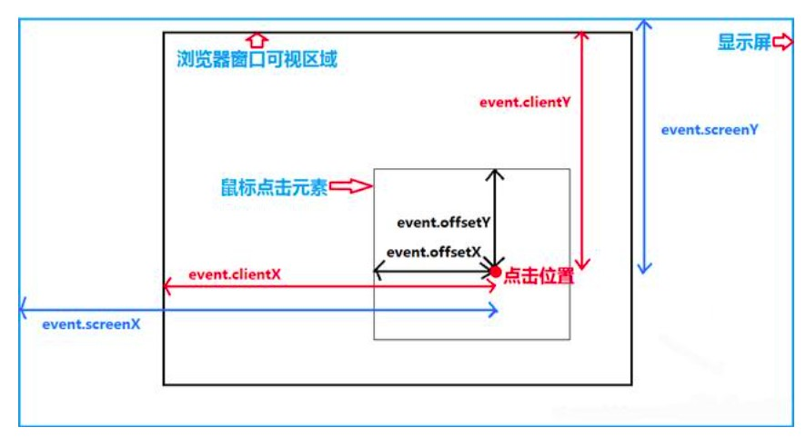

# offsetX vs clientX vs screenX

# e.target.offsetLeft | offsetTop
- .hero
    - h1
  
- mousemove 事件是包在 .hero 裡面，當滑鼠到 h1 的範圍後，offsetX | Y 會重新計算 (h1 範圍)，
- 這樣的值不是我們想要的，我們想要的是 .hero 的 offsetX | Y，
- 因此我們可以將這時候的 offsetX | Y 加上 h1.offsetLeft | Top，這樣就會變成 .hero 的座標值了。