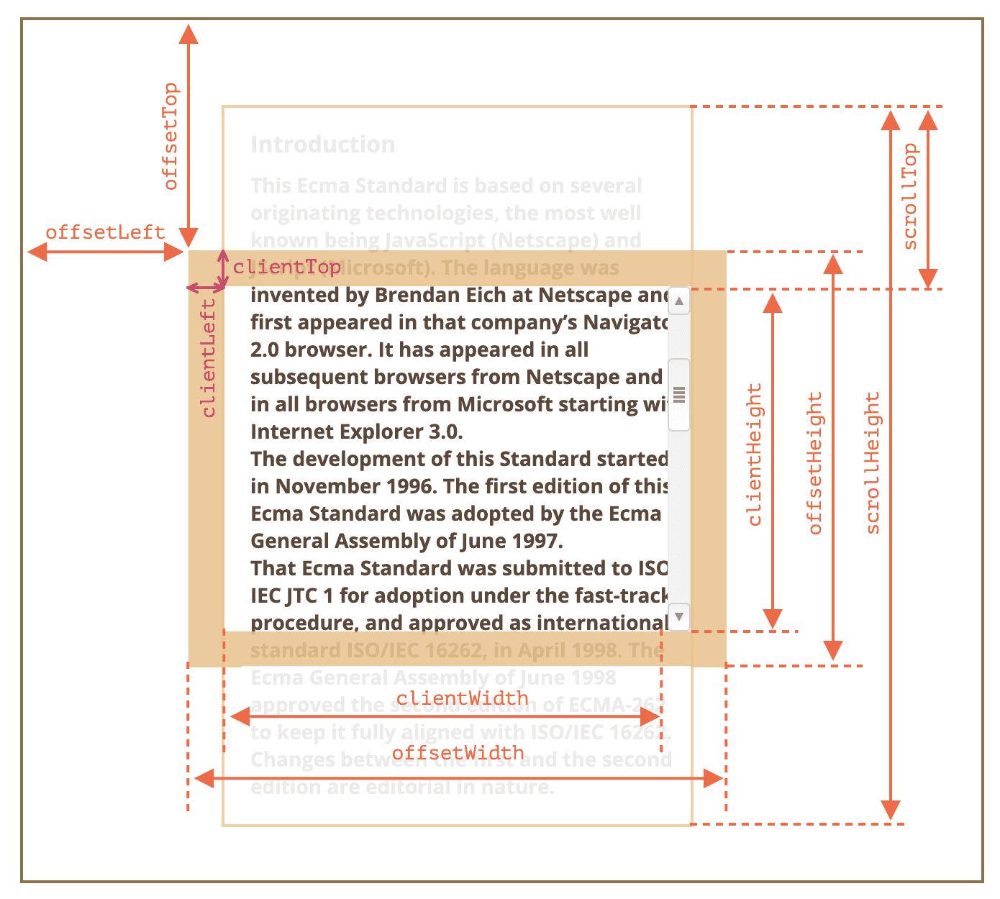

## offsetWidth, offsetHeight
- offsetWidth，offsetHeight 是「元素本身」的寬度/高度，並完整了包含了邊界、捲軸及padding。
  
    

## clientWidth, clientHeight
- clientWidth，clientHeight 是元素所包含的「子元素」的寬度及高度，其中包含了padding，但不包含邊界及捲軸。

    

## 元素的相對位置
關於元素的相對位置，同樣也有三組屬性可以使用，分別是 offsetLeft, offsetTop，clientLeft, clientTop，及 scrollLeft, scrollTop。

- offsetLeft, offsetTop : 是元素本身相對於母元素的水平/垂直距離。
- clientLeft, clientTop : 是元素本身內外的水平/垂直距離，也就是左邊/上面的邊界寬度。（但要注意文字右到左時，左邊有捲軸的情況下，也會包含捲軸寬度）
- scrollLeft, scrollTop : 是「內容」被捲動的距離，也就是內容頂端和捲軸頂端的相對距離。這個屬性很常用到，一定要跟他很熟！

